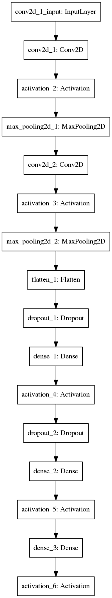

# **Traffic Sign Classifier Project**

The goals of this project are:
* To build a model to classify traffic signs images;
* To training the model in German Traffic Sign Database and evaluate its performance;
* To reflect about upon the pros and cons of using Deep Learning strategy in Autonomous Car solutions.

### The German Traffic Sign Dataset

Udacity has provided a subset for the [German Traffic Sign Dataset](http://benchmark.ini.rub.de/?section=gtsrb&subsection=dataset) that can be found in [Udacity Traffic Sign Dataset](http://s3-us-west-1.amazonaws.com/udacity-selfdrivingcar/traffic-signs-data.zip). This zip file contains 3 separated files:
1. **train.p** a python pick file with 34799 images and labels to be used as train dataset;
2. **valid.p** a python pick file with 4410 images and labels to be used as validation dataset;
3. **test.p** a python pick file with 12630 images and labels to be used as test dataset;
4. All images are 32 pixels x 32 pixels size with 3 RGB channels;
5. For each dataset there is a numpy array storing label. A label is a integer between 0 and 42 and indicates sign class. File [signames.cvs](signames.cvs) provides description for each class.

### Loading and exploring dataset
The [iPython Notebook](notebook.ipython) in section **Step 1: Dataset Summary & Exploration** reads the datasets and show some metadata. The notebook shows  sample images for each dataset that contain low resolution images and light conditions can be very hard in some cases. That those are supposed to be *real* images.

**Note:** to execute this code it is necessary to copy files train.p, valid.p and test.p to data directory.

### Model Architecture
To classify the provided images we have trained a Convolutional Neural Network very similar to [LeNet5](http://yann.lecun.com/exdb/publis/pdf/lecun-98.pdf) model. In fact, we have implemented a Tensorflow LeNet5 with following adjustment:

1. LeNet5 was designed to handle grayscale images but sign images are colorful. It was necessary to change number the number of channels in input to 3. As a consequence,  we enlarge depth CNN volume in the first and second layers.

2. Follow a model graph representation:

]

3. As we do not have a large dataset and we have expanded network capacity, it is very likely that the network will overfit. We have regularized the network using [Dropout](http://jmlr.org/papers/volume15/srivastava14a.old/srivastava14a.pdf) after the two full connected layers with keep probability given by **keep_prob**  hyper-parameter (to be adjusted in training step);

4. We have adjusted the last layer to be a softmax with 42 values (one for each class probability);

5. We have used **relu** as activation function in all layers except the last (which uses softmax activation);

6. Python function **buildModel** is responsible to build the Tensorflow model and return it as a dictionary.

### Training
As the training dataset is very small to deep neural networks and to avoid overfit, we have implemented **data augmentation** to increase dataset size and diversity. We have the original train dataset stored in **X_train** and it is used by function **get_mini_batch** to generate new images.

To new images are obtained by random rotation and scale in original images. The rotation and scale applied is implemented in **Pre-process the Data Set (normalization, grayscale, etc)** section. Besides, we apply normalization to images to constrain pixel value between -1.0 to 1.0.

During training step, function **get_mini_batch** is called many times to apply random rotation/scale and generate new images. For each original image is generated 130 new images.

We have choose **Adam** optimizer with **learning rate** of **0.0009**. We store the loss and accuracy values for each epoch and interrupts training when loss (in train dataset) stops to decrease after 5 epochs (or epochs reach 100).

### Loss and Accuracy
For each training epoch, We show loss and accurary in train and validation datasets. At the end, we computes these metrics in test dataset.

We could obtain 100% accuracy in train dataset (most likely because overfitting) and 98.9% in validation dataset. In test dataset, We have got 98.3% accuracy.

### Evaluate Model Using Images From Web
We have captured some images from web to evaluate the model. There are 16 images cropped, resized and labeled, they are webdata directory. In section **Step 3: Test Model on New Images** we try to predict class for each one and compare with real class. The accuracy in this set was poor, around 64%.

In this small set we show to top 5 prediction class for each image.   

### Visualizing CNN State
Deep Learning models are critized to work as black boxes because it is hard to understanding what and how they are doing. A method to help compreheend better a model is visualize its internal states during prediction and get intuition about what is happening.

We have implemented the function **outputFeatureMap** to visualize results after the first convolutional layer and applied to a image. That result could be seen in **Step 4: Visualize the Neural Network's State With Images** section.

### Conclusion

We could reach very reasonably accuracy using a simple model what encorage us to use **Deep Learning** models in other problems related with image understandins/classification. This kind of problem is very common in *Autonomous Car* area, in fact, Deep Learning is changing radically this field.

We could see that **data augmentation** is a very efficient method when datasets are small. It helps to fight overfitting increasing generalization and it is cheap to apply.

As a future work, we would like to test other models as proposed [End do End Learning for Self-Driving Cars](https://arxiv.org/pdf/1604.07316v1.pdf) by **Nvidia** and [Dynamic Routing Between Capsules](https://arxiv.org/pdf/1710.09829.pdf) by **Geoffrey Hinton and others**.
